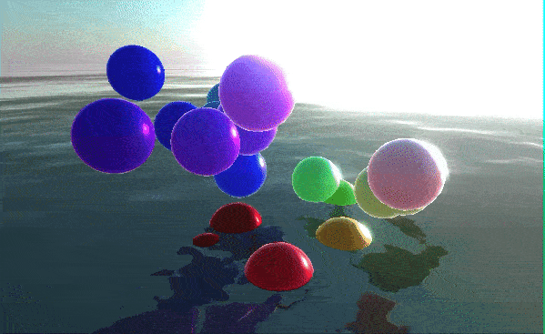

# Graphics3D Parser based on THREE.js
*written with love in Javascript*

***Warning: Early Development Stage!***



```mathematica
Graphics3D[{Roughness[0], Reflectivity[1], IOR[2], Clearcoat[0.5], Table[{RGBColor[Normalize[i]], Sphere[i]}, {i, RandomReal[{-5,5}, {40,3}]}], SkyAndWater[]}, Background->None, Lighting->None]
```

See disscussion at [mathematica.stackexchange](https://mathematica.stackexchange.com/a/215025/53728).

__This is a core component of [Wolfram JS Frontend](https://github.com/JerryI/wolfram-js-frontend) project__
but one can use it independently as well

__Live demo on [WLJS Interpreter](https://github.com/JerryI/wljs-interpreter) sandbox__ 


## Contributing
------------

Please feel encouraged to contribute and expand features.

Issues
------
There a lot a functions which are not implemented such as ``Style[]``, ``Tube[]``, ``Ball[]``, ``Cone[]``, ``BezierCurve[]``...

Currently the minimum necessary set for the functioning of ``SphericalPlot3D``, ``Plot3D`` is already done
- ``Graphics3D`` - supported without styling, themes, custom lighting
- ``List`` - supported
- ``GraphicsGroup`` - supported
- ``RGBColor`` - supported
- ``Opacity`` - supported
- ``Tube`` - renders like arrows
- ``Sphere`` - supported
- ``Center`` - supported
- ``Tetrahedron`` - supported
- ``Cylinder`` - supported
- ``Polyhedron`` - supported
- ``GeometricTransformation`` - fully supported
- ``GraphicsComplex`` - supported
- ``Polygon`` - fully supported
- ``Line`` - supported

### Extra features
- ``Emissive[]`` - property fro the object to emitt light
- ``IOR[]`` - specify the refractive index
- ``Reflectivity[]`` - reflectivity of the material
- ``SkyAndWater[]`` - apply shader to the scene with animated ocean and sun
- subsurface scattering
- bloom control from the menu

## Development

## Tests

```mathematica
wolframscript -f buildtests.wls
npm run watch
```

you can easily add new scenes by adding files into `tests/src` dir. 
For the complex scenes use `LoadPage["templates/signlepage_nodom.wsp"]` instead of `LoadPage["templates/signlepage.wsp",{data = json}]`.

## License

Project is released under the GNU General Public License (GPL).
